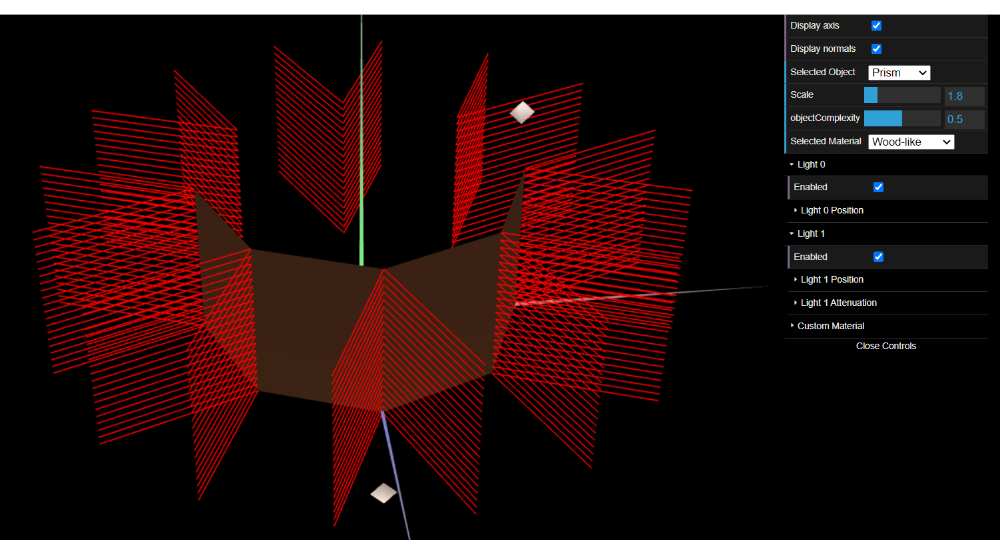
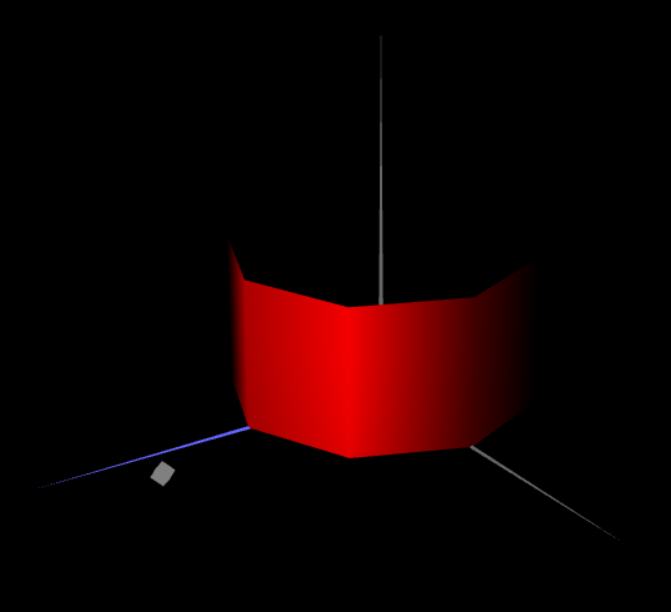

# CG 2022/2023

## Group T09G09

## TP 3 Notes

- Some problems to understand the display of the figures to do the tangram with the different colors.

- Difficulties in calculating the angles, specifically of the normals in Parts 2 & 3 of the exercise.
- The process of eliminating all redundant vertices in the cilinder, while still maintaining an iterative rather than brute-force approach also proved challenging. In the end we solved the problem by creating a n if clause for the very last iteration, allowing it to create faces between the very last and very first vertices added.

