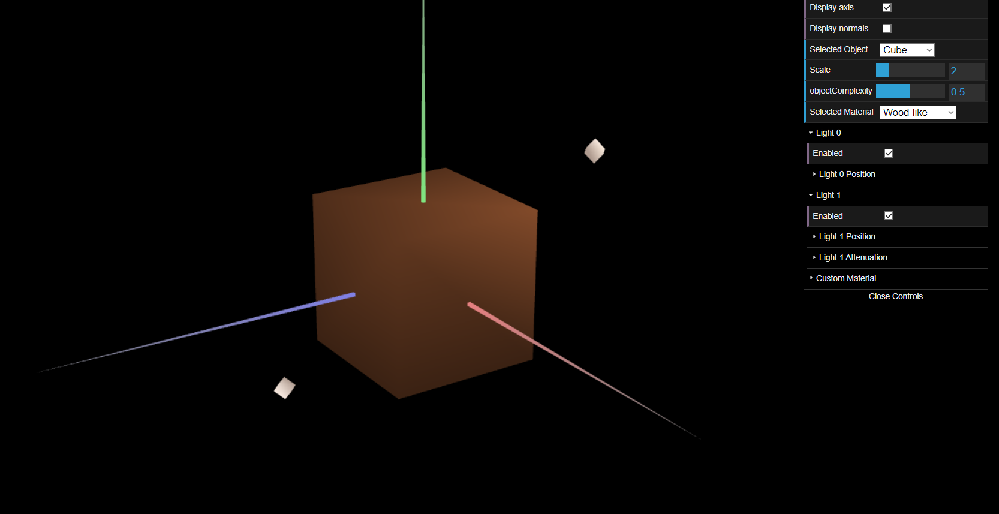
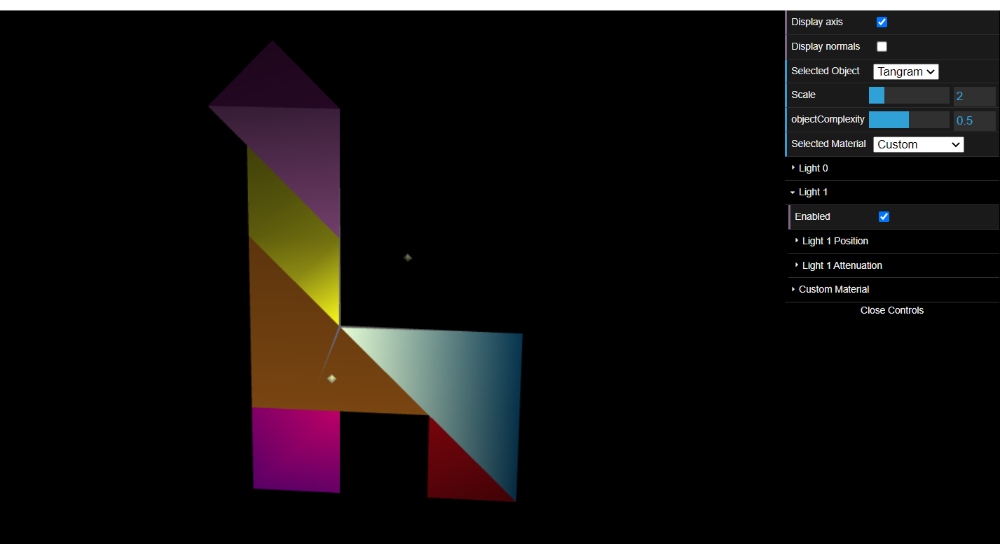

# CG 2022/2023

## Group T09G09

## TP 3 Notes

- Some problems to understand the display of the figures to do the tangram with the different colers.
- We learn different things , and important things to apply in other works.

