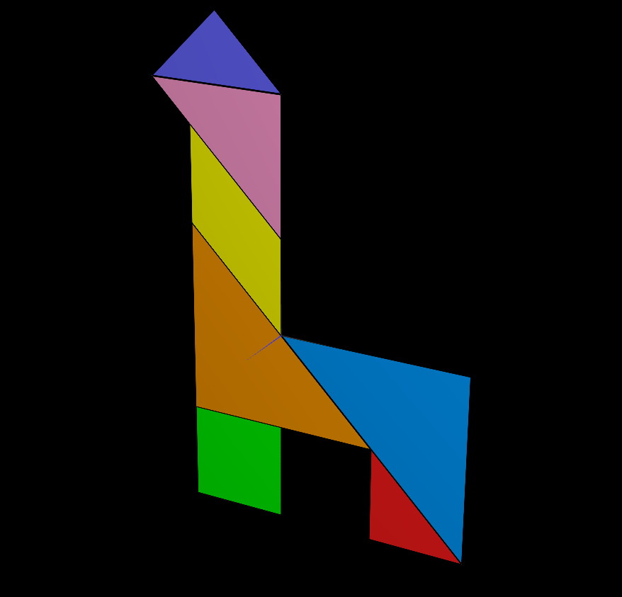
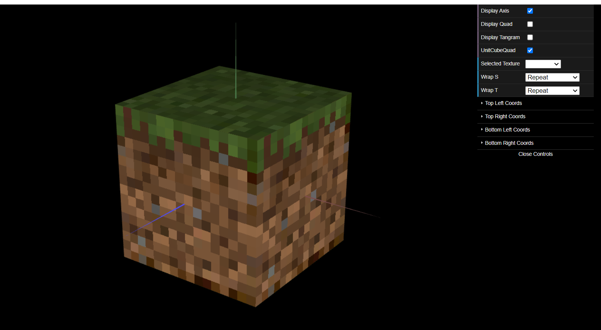

# CG 2022/2023

## Group T09G09

## TP 4 Notes

- Some problems to understand correct implementation of the constructor , the constructor that receives textures as parameters, to ensure that the textures are applied to the correct faces of the cube.

