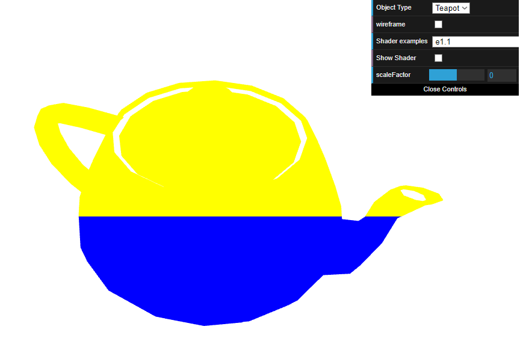

# CG 2022/2023

## Group T09G09

## TP 5 Notes

- Most of the struggle in this TP was related to understanding the general workings of shaders, specifically the differences between vertex and fragment shaders as well as what the many variables declared in each one meant.

- After getting the grasp of that, the exercises were relatively straightforward.

- Exercise 2.4 also proved challenging but after a few experiments we settled on adding a multiple of timeFactor to the coordinates of vTexture(x and y). Though this approach is valid, the movement of the water is a bit janky and though we tried we couldn't get perfectly smooth movement of the water.

